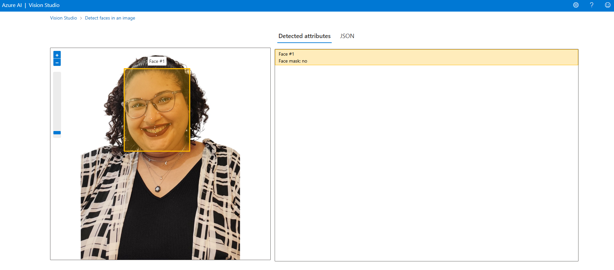
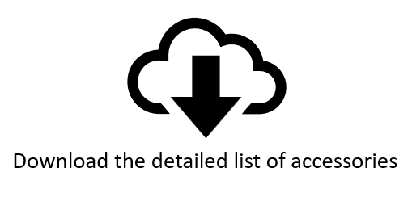
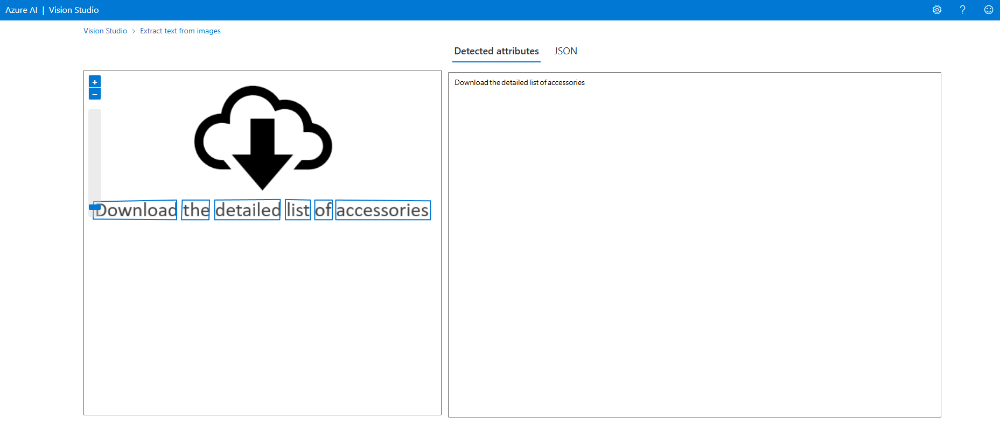
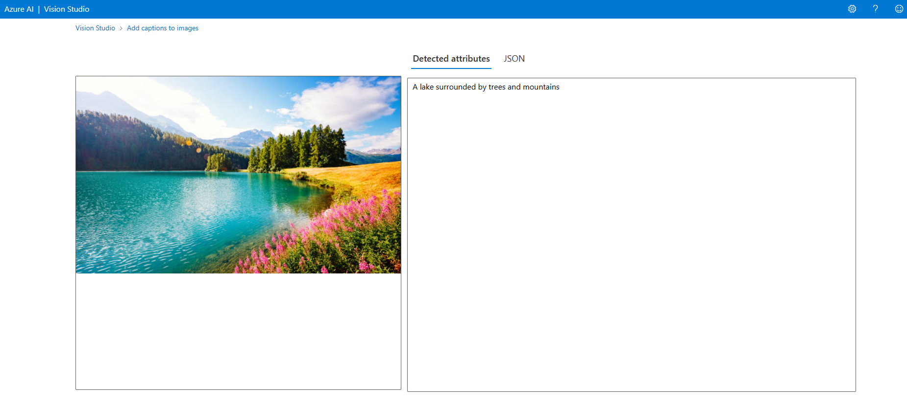

<h1>Reconhecimento Facial e transformação de imagens em Dados no Azure ML</h1>


<h3>Repositório criado para o desafio do bootcamp Microsoft - Fundamentos de IA</h3>

<h4 align="justify">Descrição do projeto</h4>

<p align="justify">
    Este projeto demonstra como utilizar os serviços do Azure AI para realizar reconhecimento facial, extração de texto e geração de legendas em imagens.
</p>

<br>

<h2 align="justify">Configuração do Projeto</h2>

<p align="justify">

<strong>1. Criação e Configuração do Azure AI Services</strong>
<ul>
    <li>Acesse o portal do Azure e crie uma instância do Azure AI Services.
    <li>Configure as chaves de acesso e o endpoint necessários para utilizar as APIs de visão computacional.
</ul>

<strong>2. Portal de Testes do Azure Vision</strong>
<ul>
    <li>Acesse o portal de demonstração: <a href="https://portal.vision.cognitive.azure.com/">Azure Vision Portal</a>.
    <li>Realize testes utilizando as ferramentas integradas.
</ul>

</p>

<br>

<h2 align="justify">Etapas realizadas</h2>

<h3 align="justify">1. Reconhecimento Facial</h3>

<p align="justify">Testei o reconhecimento facial utilizando uma foto pessoal:</p>

<br><br>
<p align="justify">O sistema retornou informações como:</p>

<br><br>
<p align="justify">O JSON:</p>

```json
[
  {
    "recognitionModel": "recognition_01",
    "faceRectangle": {
      "width": 395,
      "height": 499,
      "left": 262,
      "top": 125
    },
    "faceLandmarks": {
      "pupilLeft": {
        "x": 345.6,
        "y": 348.7
      },
      "pupilRight": {
        "x": 501.8,
        "y": 315.8
      },
      "noseTip": {
        "x": 424,
        "y": 426.7
      },
      "mouthLeft": {
        "x": 367.7,
        "y": 492.8
      },
      "mouthRight": {
        "x": 538.7,
        "y": 459
      },
      "eyebrowLeftOuter": {
        "x": 291.4,
        "y": 315.7
      },
      "eyebrowLeftInner": {
        "x": 366.2,
        "y": 304.9
      },
      "eyeLeftOuter": {
        "x": 318,
        "y": 353.6
      },
      "eyeLeftTop": {
        "x": 347.3,
        "y": 340.4
      },
      "eyeLeftBottom": {
        "x": 342.7,
        "y": 354.9
      },
      "eyeLeftInner": {
        "x": 374.6,
        "y": 345.9
      },
      "eyebrowRightInner": {
        "x": 450.5,
        "y": 289.5
      },
      "eyebrowRightOuter": {
        "x": 552.6,
        "y": 271.4
      },
      "eyeRightInner": {
        "x": 474,
        "y": 325.2
      },
      "eyeRightTop": {
        "x": 495.7,
        "y": 307.4
      },
      "eyeRightBottom": {
        "x": 504.8,
        "y": 322
      },
      "eyeRightOuter": {
        "x": 532.5,
        "y": 308.6
      },
      "noseRootLeft": {
        "x": 395.8,
        "y": 350.9
      },
      "noseRootRight": {
        "x": 440.4,
        "y": 341.5
      },
      "noseLeftAlarTop": {
        "x": 389.6,
        "y": 406.5
      },
      "noseRightAlarTop": {
        "x": 464.8,
        "y": 391.4
      },
      "noseLeftAlarOutTip": {
        "x": 380.4,
        "y": 435.1
      },
      "noseRightAlarOutTip": {
        "x": 488.3,
        "y": 415.8
      },
      "upperLipTop": {
        "x": 447.4,
        "y": 475.7
      },
      "upperLipBottom": {
        "x": 445.4,
        "y": 485.8
      },
      "underLipTop": {
        "x": 450.4,
        "y": 511.7
      },
      "underLipBottom": {
        "x": 454.2,
        "y": 530.3
      }
    },
    "faceAttributes": {
      "mask": {
        "type": "noMask",
        "noseAndMouthCovered": false
      }
    }
  }
]


```

<h3 align="justify">2. Extração de Texto</h3>

<p align="justify">Realizei o upload de uma imagem contendo texto escrito.</p>

<br><br>
<p align="justify">O serviço reconheceu com precisão as palavras e gerou o seguinte resultado:</p>

<br><br>
<p align="justify">O JSON:</p>

```json
[
  {
    "lines": [
      {
        "text": "Download the detailed list of accessories",
        "boundingPolygon": [
          {
            "x": 13,
            "y": 184
          },
          {
            "x": 494,
            "y": 184
          },
          {
            "x": 494,
            "y": 212
          },
          {
            "x": 13,
            "y": 212
          }
        ],
        "words": [
          {
            "text": "Download",
            "boundingPolygon": [
              {
                "x": 14,
                "y": 187
              },
              {
                "x": 132,
                "y": 185
              },
              {
                "x": 132,
                "y": 213
              },
              {
                "x": 13,
                "y": 212
              }
            ],
            "confidence": 0.994
          },
          {
            "text": "the",
            "boundingPolygon": [
              {
                "x": 140,
                "y": 185
              },
              {
                "x": 179,
                "y": 185
              },
              {
                "x": 178,
                "y": 213
              },
              {
                "x": 139,
                "y": 213
              }
            ],
            "confidence": 0.999
          },
          {
            "text": "detailed",
            "boundingPolygon": [
              {
                "x": 186,
                "y": 185
              },
              {
                "x": 280,
                "y": 184
              },
              {
                "x": 279,
                "y": 213
              },
              {
                "x": 186,
                "y": 213
              }
            ],
            "confidence": 0.994
          },
          {
            "text": "list",
            "boundingPolygon": [
              {
                "x": 287,
                "y": 184
              },
              {
                "x": 323,
                "y": 185
              },
              {
                "x": 323,
                "y": 213
              },
              {
                "x": 287,
                "y": 213
              }
            ],
            "confidence": 0.984
          },
          {
            "text": "of",
            "boundingPolygon": [
              {
                "x": 329,
                "y": 185
              },
              {
                "x": 354,
                "y": 185
              },
              {
                "x": 354,
                "y": 213
              },
              {
                "x": 329,
                "y": 213
              }
            ],
            "confidence": 0.999
          },
          {
            "text": "accessories",
            "boundingPolygon": [
              {
                "x": 359,
                "y": 185
              },
              {
                "x": 494,
                "y": 186
              },
              {
                "x": 494,
                "y": 213
              },
              {
                "x": 359,
                "y": 213
              }
            ],
            "confidence": 0.994
          }
        ]
      }
    ]
  }
]

```

<h3 align="justify">3. Geração de Legendas para Imagens</h3>

<p align="justify">Testei a funcionalidade de adicionar legenda a uma imagem.</p>
<p align="justify">Imagem utilizada:</p>

<br><br>
<p align="justify">Resultado gerado:</p>

<br><br>
<p align="justify">O JSON:</p>

```json
{
  "apim-request-id": "d7d6c64e-35f5-41b8-8409-3590b3801479",
  "content-length": "167",
  "content-type": "application/json; charset=utf-8",
  "modelVersion": "2023-10-01",
  "captionResult": {
    "text": "a lake surrounded by trees and mountains",
    "confidence": 0.7147327661514282
  },
  "metadata": {
    "width": 612,
    "height": 372
  }
}
```

<h2 align="justify">Possibilidades Futuras</h2>
<ul>
<li>Integração com aplicações maiores, como:
<ul>
    <li>Automação de processos com reconhecimento de texto em documentos.
    <li>Aplicativos que utilizem reconhecimento facial para autenticação.
    <li>Sistemas que utilizem legendas automáticas para imagens como suporte à acessibilidade.
</ul>
<li>Melhorar a acurácia dos serviços com treinamento personalizado no Azure Custom Vision.
</ul>

<h2 align="justify">Como Utilizar</h2>
<ul>
<li>Configure sua conta no <a href="https://portal.azure.com/">Azure Portal</a>.
<li>Siga as etapas descritas acima para explorar as funcionalidades de Visão Computacional.
<li>Clone este repositório para acessar exemplos e os resultados dos testes realizados.
</ul>